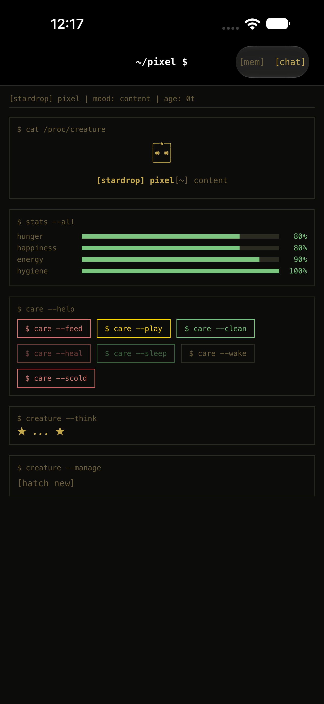
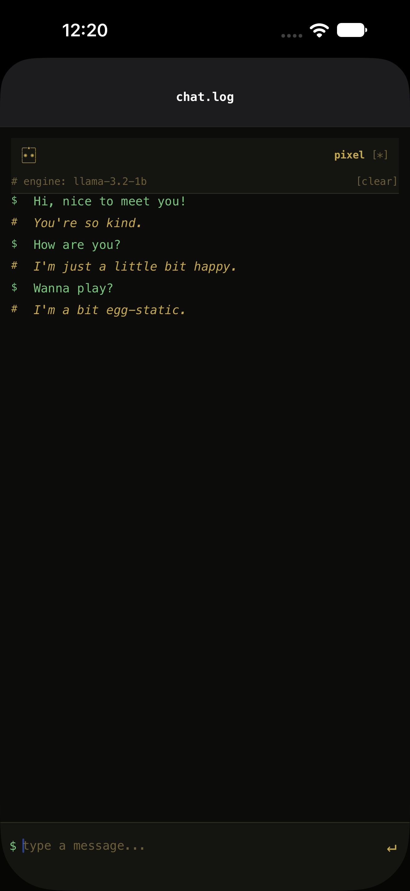
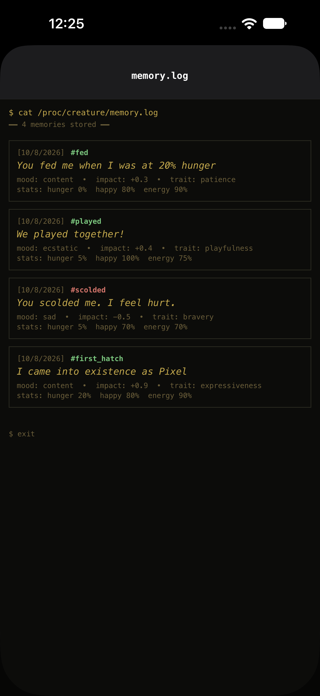
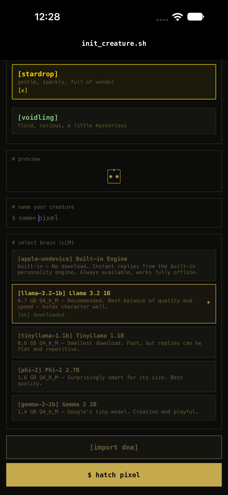

# AI Tamagotchi

> An AI-powered digital pet that lives on your phone. Terminal aesthetic. Fully on-device.

A companion creature with real personality, memory, DNA, and evolution — driven by a local LLM running directly on your phone via `llama.rn`. No cloud. No API keys. No data leaves your device.

---

## Screenshots

<table>
<tr>
<td></td>
<td></td>
<td></td>
<td></td>
</tr>
<tr>
<td align="center">Home</td>
<td align="center">Chat</td>
<td align="center">Memory log</td>
<td align="center">Hatch</td>
</tr>
</table>

Captured on the 6.9-inch simulator from a Release build (1320×2868, the size App Store Connect requires).

---

## Features

| Category | Detail |
|---|---|
| 🖥️ **Terminal Aesthetic** | Retro CRT-inspired amber-on-black interface. Creature lives in a command line. |
| 🧠 **On-Device AI** | Real LLM-powered conversations via llama.cpp (`llama.rn`). DNA, personality, mood, stage, and state injected into every response. |
| 🗣️ **Stage-Aware Voice** | Egg → baby talk → child curiosity → teen moodiness → adult personality. Speech evolves with the creature. |
| 📊 **State-Driven Dialogue** | Hunger, energy, happiness, hygiene all affect how the creature talks. Template fallback matches LLM voice rules. |
| 🍎 **Care System** | Feed, play, clean, heal, tuck in, wake up — plus **scold** (negative interaction, -25 happiness). Stats decay over real time. |
| ⏱️ **Sleep Cooldown** | Tuck in for 5+ minutes to recover energy. Wake too soon and they're grumpy — no infinite energy loop. |
| 🧬 **Creature DNA** | Every creature has a unique genetic identity. Traits, personality, and appearance procedurally generated. |
| 🧠 **Episodic Memory** | Rich event-based memories with mood context and stat snapshots. Stored memories are fed into the creature's prompt, and there is a memory viewer screen. Recall is only as good as the model — see [Known Limitations](#known-limitations). |
| 🧫 **Epigenome** | Memories reshape gene expression over time. Happy memories → +social. Neglect → +resilience. Modifiers inherited at 70% strength. |
| 💬 **Conversation** | Chat affects the creature — kind words boost happiness, mean words hurt (×15 negative multiplier). Real role-structured messages, so the model's own chat template applies. History feeds the prompt, and `[clear]` (or the `/clear` command) takes it back. |
| 🦋 **Evolution** | Egg → Baby → Child → Teen → Adult (~18 days real time). 4 branches: Angel, Gremlin, Trickster, Sage. |
| 💀 **Death** | Neglect leads to consequences — the creature can pass away if 3+ stats hit zero. |
| 🧬 **DNA Export** | On death, export the creature's full DNA as a `.json` file via iOS Share sheet. Includes genotype, epigenome, memories. |
| 📥 **DNA Import** | Hatch from inherited DNA — pick a `.json` file, species auto-detected. Single-parent inheritance with 70% epigenetic decay. |
| ⏱️ **Real-time Clock** | Stats decay every 30s while the app is open. Age passes in real world time. |
| 💾 **Persistent Storage** | MMKV — full creature state (stats, personality, stage, sleep) survives restarts and phone reboots. |
| 🎨 **App Icon** | Amber egg outline with big glossy eyes on warm black — full-bleed, no baked rounded corners, no transparency, so the system mask is the only shape. |
| 🔒 **100% Offline** | No internet required. Everything on-device. Release build pre-compiles Hermes bytecode. |

---

## Tech Stack

| Layer | Technology |
|---|---|
| **Framework** | React Native 0.82 (Fabric / New Architecture) |
| **LLM Inference** | `llama.rn` — React Native binding for llama.cpp |
| **State** | Zustand + MMKV (persistent) |
| **Navigation** | React Navigation (native stack) |
| **Models** | GGUF format, downloaded via `react-native-fs` |
| **File Picker** | `react-native-document-picker` (DNA import) |
| **Language** | TypeScript (strict) |
| **GPU** | Metal (Apple GPU) — ~50 tok/s on A18 Pro |

---

## Quick Start

```bash
cd ai-tamagotchi
npm install --legacy-peer-deps
cd ios && pod install && cd ..

# Simulator (dev mode):
npx react-native start --port 8081
npx react-native run-ios --simulator="iPhone 17"

# iPhone (release mode — no Metro needed, survives sleep):
npm run ios:release
```

> **Note:** RN 0.82 requires React 19.1.1 (exact). Xcode 26.5 needs `objectVersion` set to 60 for `pod install` (Podfile handles this). fmt library needs consteval→constexpr patch (Podfile post_install hook). Hermes does not support `structuredClone()` — use `JSON.parse(JSON.stringify())` instead.

### Toolchain requirements

- **Xcode 26** (full app — Command Line Tools alone are not enough) with an iOS 26 SDK
- **CocoaPods** — install via Homebrew (`brew install cocoapods`). The macOS
  system Ruby (2.6) is too old for current CocoaPods.
- **Node 20+** and npm 11+
- npm 11 blocks dependency install scripts by default. `llama.rn` ships
  prebuilt iOS artifacts (`ios/rnllama.xcframework`); if that directory is
  missing after `npm install`, run
  `npm install-scripts approve llama.rn && npm rebuild llama.rn`.

### Releasing to the App Store

Everything needed for a submission — listing copy, App Privacy answers, age
rating guidance, review notes and the build/upload sequence — is in
[`docs/app-store-submission.md`](docs/app-store-submission.md).

---

## Project Structure

```
ai-tamagotchi/
├── src/
│   ├── screens/           # CreateCreature, Home, Chat, Memory
│   ├── components/
│   │   └── creature/      # CreatureCard, StatBar, CareButton
│   ├── services/
│   │   └── creature/      # AIService, ModelManager, creatureEngine, dna,
│   │                      # asciiRenderer, conversationManager, WidgetExporter
│   ├── store/             # Zustand (creatureStore, useCreatureStore)
│   ├── types/             # TypeScript types
│   ├── constants/         # Creature art, species config
│   └── theme.ts           # Terminal color palette
├── ios/                   # Xcode project, Pods, WidgetBridge
├── models/                # Downloaded GGUF files (gitignored)
├── __tests__/             # Jest test suites
└── index.js               # App entry
```

---

## Architecture

### Creature State Machine
Pure TypeScript (`creatureEngine.ts`). Every interaction produces a new immutable state. DNA procedurally generated, persisted via MMKV.

### AI Pipeline
1. Model chosen at creation → GGUF downloaded from HuggingFace, verified against a SHA-256 digest
2. `llama.rn` loads it on hatch, and **reloads it on every launch** — the choice is persisted with the creature
3. Chat → role-structured messages (`system` + history + `user`), so the model's own chat template applies
4. System prompt includes: DNA, personality, stage voice, current state as feelings, and the creature's stored memories
5. Inference on-device. A stage-aware template engine answers *only* when no model is loaded, and the chat header names the engine that replied

### Stage-Aware Voice
The system prompt shapes *how* the creature speaks — tone, not word counts. An earlier version capped length per stage ("NEVER write more than 2 words"), which contradicted the rule asking for a sentence and filtered every reply into baby-talk, question unanswered:
- **Egg** — mostly feelings; a few words at most
- **Baby** — simple words, short sentences, easily amazed
- **Child** — short sentences, curious, asks questions
- **Teen** — growing confidence, occasional moodiness
- **Adult** — full sentences, distinct personality

### State-Driven Dialogue
Hunger, energy, happiness and hygiene are injected as plain statements of feeling:
- Hunger > 80 → "You are very hungry."
- Energy < 20 → "You are exhausted and very sleepy."
- Happiness < 30 → "You feel unhappy and want comfort."
- Hygiene < 30 → "You feel dirty."

They used to be shouted imperatives ("⚠️ EXHAUSTED. Act drowsy, yawn."), which the model obeyed
literally — answering "*yawn*" instead of the question, and drowning out both the question and
the memories. A rule in `HOW YOU TALK` keeps them in proportion: *"Let how you feel colour your
answer, but never instead of answering it."*

### DNA & Inheritance
- **Genotype**: procedural species, seed, base stats, trait alleles
- **Phenotype**: expressed traits, appearance, stage, branch
- **Epigenome**: `Record<string, number>` — memory-driven modifiers (-1.0 to +1.0)
- **Export**: `buildDNAExport()` → JSON with full DNA + life summary
- **Import**: `createFromDNA()` → preserves genotype, breeding history, 70% epigenetic decay
- **Validator**: allows 0, 1, or 2 parent IDs (supports inheritance + future breeding)

### Evolution
- Egg (12h) → Baby (2d) → Child (5d) → Teen (10d) → Adult (∞)
- Branches: Angel (kindness), Gremlin (neglect), Trickster (playfulness+genes), Sage (conversations)

### Death
Energy at 0 + 3 critical stats → creature passes away → gravestone screen → export DNA or hatch new.

### Persistence
- **MMKV**: Full creature state (stats, personality, stage, branch, age, sleep state, epigenome) **and the model the creature runs on** — without the latter, every relaunch silently reverted to the template engine
- **RNFS**: Downloaded GGUF models, verified by SHA-256 on download
- **Session-only**: Chat messages

## Known Limitations

Small app, real gaps. Stated so nobody has to discover them:

- **1B models recall literally.** The creature reliably names a memory when asked about it directly — *"do you remember when I scolded you?" → "you were cross with me... it still stings"* — but can miss a vague question like *"what did I just do?"*, answering atmospherically instead of with the event. It holds the memory; it does not always connect the question to it. Bigger models close this gap at the cost of download size and RAM, so 1.0 stays lean.
- **Download progress is read from the filesystem, not from RNFS.** RNFS's `progress` event never fires on iOS 27 (New Architecture), so the percentage is derived from the size of CFNetwork's temp file. Before that, the picker showed 0% for the entire download while hundreds of megabytes were arriving — and a stall watchdog built on the missing event cancelled downloads that were working perfectly. Both are fixed; if you touch `downloadModel`, never trust that callback.
- **The creature occasionally slips into the second person.** Asking *"do you remember when I scolded you?"* got `It still stings.` (correct) but also, once in about five tries, `You still hurt.` — narrating the owner instead of itself. Prompt wording reduces it; a 1B model does not eliminate it.
- **The fallback engine is visible, never silent.** With no model loaded, the creature answers from a stage-aware template engine; the chat header names the engine that replied (`# engine: llama-3.2-1b`), so canned lines can't be mistaken for the LLM.
- **iPhone only, no widget.** The widget is deferred to 1.1; its extension target is not in the 1.0 project.

---

## Development Status

- [x] Terminal-themed UI
- [x] Core creature state machine
- [x] DNA system & ASCII renderer
- [x] llama.cpp integration with role-structured messages and pinned chat template
- [x] Chat with LLM + sentiment effects (positive & negative)
- [x] Stage-aware template fallback (matches LLM voice rules)
- [x] Care system (7 actions: feed, play, clean, heal, tuck_in, wake_up, scold)
- [x] Sleep cooldown (5 min minimum for energy recovery)
- [x] Stage-aware creature voice (speech evolves with age)
- [x] State-driven dialogue (hunger/energy/happiness affect conversation)
- [x] Evolution (5 stages, 4 branches)
- [x] Death mechanic + DNA export
- [x] DNA import with file picker + single-parent inheritance
- [x] Epigenome — memories reshape gene expression
- [x] Episodic memory + viewer
- [x] Model download & management (SHA-256 verified; progress measured on disk, see Known Limitations)
- [x] Model persisted with the creature and reloaded on launch
- [x] Chat header names the answering engine (never a silent fallback)
- [x] Clear conversation (`[clear]` control and `/clear` command)
- [x] Creatures age in real time — stages measured in days, not minutes
- [x] Verified on a physical iPhone (download, SHA-256 verification, Metal inference, persistence across launches)
- [x] MMKV persistence (full state, survives reboots)
- [x] Real-time stat clock
- [x] Release build with pre-compiled Hermes bytecode
- [x] App icon (amber egg, glossy eyes, amber-on-black; all 15 renditions, no alpha)
- [ ] iOS Widget (deferred to v1.1 — the extension target was removed from the Xcode project for 1.0; the JS-side `WidgetExporter` and `WidgetBridge` are kept for it)
- [ ] Android support
- [ ] Notifications
- [ ] Two-parent breeding mechanics
- [ ] Procedural species generation

---

## License

MIT
